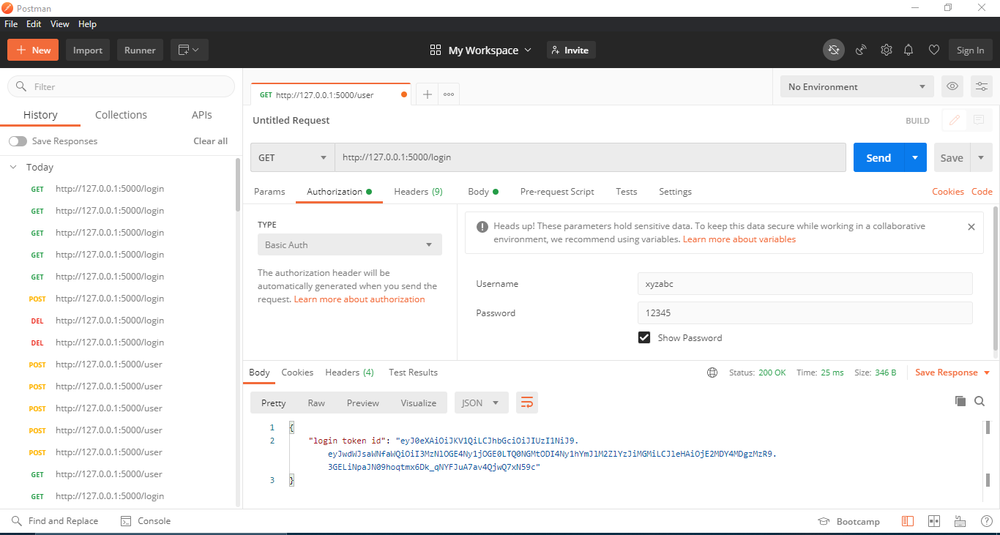

# RESTFul-API-in-JSON-and-Flask-SQLAlchemy
**Creating a RESTFul API in Flask With JSON Web Token and Flask-SQLAlchemy database**

Developing a program to create a RESTFUL API with JSON Web Token Authentication and  FlaskSQLAIchemy database which performs following operations: 

1.create a new user resource 

2.retrieve single/all user resources 

3.update existing user resource 

4.deleting existing user resource 

5.login authentication for user

# Screenshots

 
 
 
 
 
 
 
 
 
 
 
